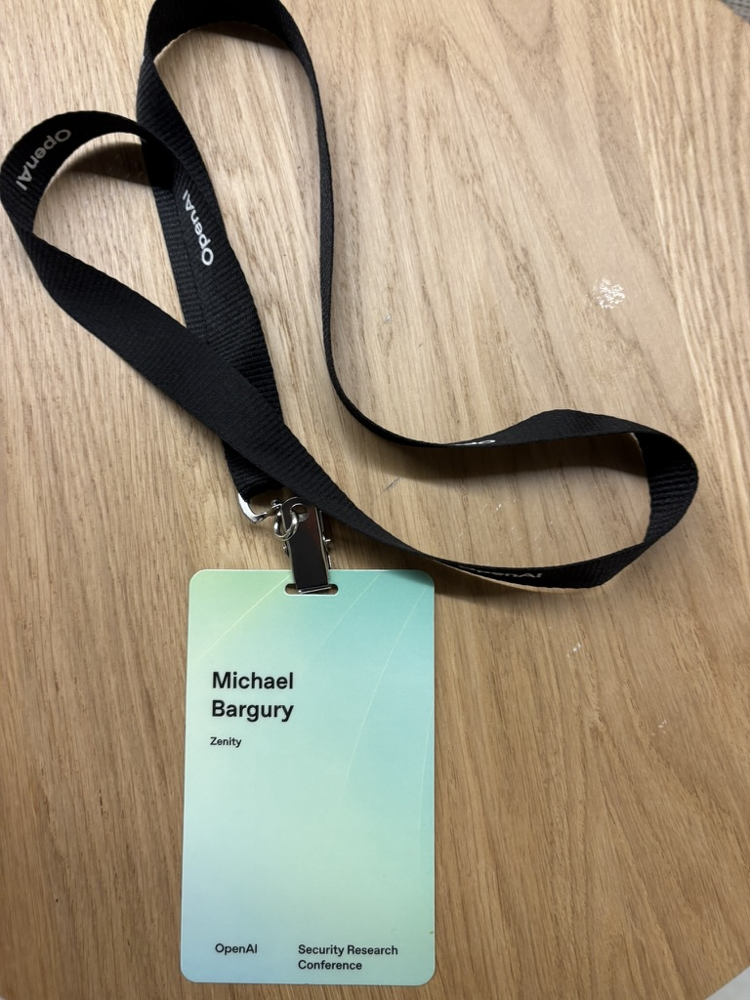

The conversation around AI is always about vibes.
So let's talk about the vibes at [OpenAI's inaugural Security Research Conference](https://www.linkedin.com/posts/daveaitel_thanks-everyone-for-coming-to-the-inaugural-activity-7324492962892046336-Gyu9) last week.

Excitement. Inquiry. Humbleness.

A few observations stuck with me.
Most of these surprised me at the moment, but seem trivial in retrospect.

Walking into a room full of the people work I've devoured for years was intimidating.
But people were genuinely curious and out to learn from each other.
There's an overall sense that [we are all n00bs](https://youtu.be/FH6P288i2PE?si=9TxeP06NUap2fJMk&t=2276) trying to figure it out.
It's humbling to see world-class experts step out of their zones and dive into emerging research.
Every hallway conversation initiated on fifth gear.
Folks were happy to openly share perspectives.
They immediately inquired about anything that seemed novel or different.

Most of the focus was placed on AI for security, not much on security from AI.
There was general consensus that prompt injection and hallucinations are a massive security problem.
When it came to solutions, it seemed like most people believed that [prompt injection is not a solvable problem](https://www.mbgsec.com/posts/2025-04-29-there-is-nothing-responsible-about-disclosure-of/).
Though some -- particularly those that work for AI labs -- hinted at ongoing research, and expressed hopes of absorbing most of the problem away from customers.
I've made the case before why I believe this line of effort is futile, and [we need a radically new approach](https://www.mbgsec.com/posts/2025-04-28-beyond-prompt-injection/).

The relationship between government and OpenAI was palpable.
Observable from friendly relationships, and the strong emphasis on policy conversations relative to security conferences: opening keynote, multiple talks.
Most subtly -- physical security guards at every corner also gave it away.
These left an overwhelming appreciation of what's at stake at the US national level (or even Western level).
Last time I sensed that mix of urgency and weight I was in uniform.

In government circles, 0day development remains the pinnacle of security research.
I almost forgot about that, having spent more than a decade out in industry.
It explains then why the allure of having AI find 0days is so strong.
Its intuitively understood as the ultimate test of intelligence.
An exciting goal for both security and AI researchers.

People have built incredibly capable autonomous systems already.
These systems are discovering vulnerabilities in Open Source projects, pen-testing web services, crafting patches.
Rather than relying on traditional security tooling, they lean on the LLM.
As [Dave Aitel](https://x.com/daveaitel) put it in his keynote, the LLM **understand and reason** rather than scans.
Bugs are miscommunications in LLM's native language -- code.
Incredible results are achieved by combining software engineering and data science skills, no heavy model-training required. 
There is a general feeling that we're crossing a chasm and everything is about to change.

I really appreciate OpenAI bringing the community together.
And everyone that contributed and shared their perspectives.
Huge thank you [Matt Knight](https://www.linkedin.com/in/matthewfknight) and [Ian Brelinsky](https://www.linkedin.com/in/ianbre) for throwing a welcoming, super interesting and fun conference!